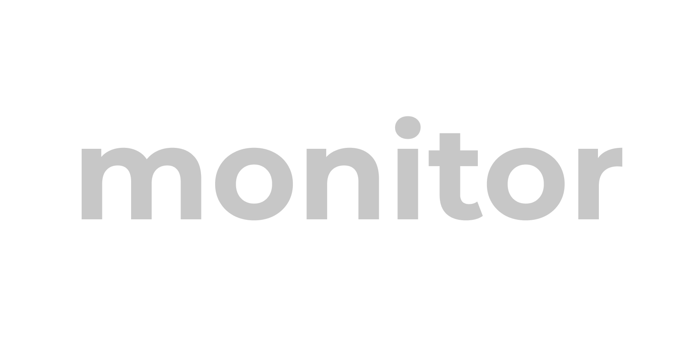
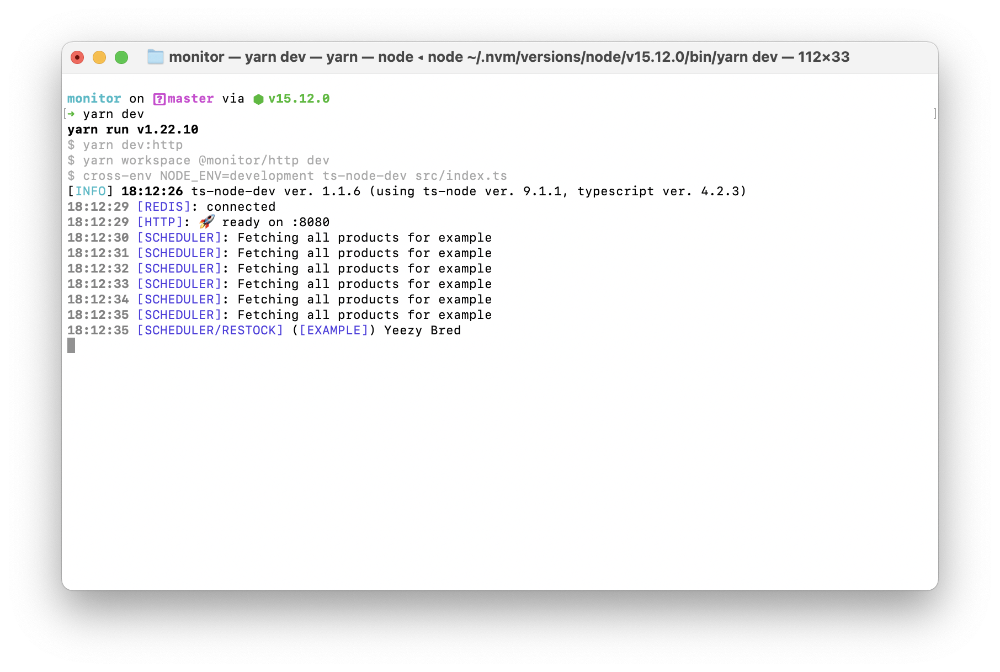

# A simple template for building restock monitors in Node.js

## Prerequesites

- Node 14+
- Some basic TypeScript knowledge
- NPM & Yarn
- Docker (unless you want to install services locally)

## Installation Instructions

1. Clone the repo
   1. `git clone https://github.com/alii/monitor`
   2. `cd monitor`
2. Install dependencies
   1. `yarn`
3. Bootstrap services (with Docker)
   1. `docker-compose up -d`
4. Get started in development mode (hot reloading)
   1. `yarn dev`
